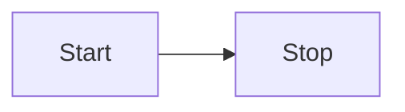

# Table of Contents

1. [Introduction](#introduction)
2. [Text Format](#text-format)
3. [Code Blocks](#code-blocks)
4. [Lists and Tables](#Lists-and-tables)
5. [Autolink literals](#Autolink-literals)
6. [Footnotes](#Footnotes)
7. [Strikethrough](#Strikethrough)
8. [Mathematical Equations](#Mathematical-equations)
9. [Flowcharts](#Flowcharts)

Press CMD+J to toggle theme

# Introduction

> Your introduction text

# Text Format

# H1

## H2

### H3

#### H4

##### H5

###### H6

Text can emphasis by _italic_, **bold**, or ~strikethrough~

This is a paragraph with **strong importance**.

> This is a block quote.

# Code Blocks

```jsx
// Example of a code block
import React from "react";

function Component() {
  return <div>Hello, world!</div>;
}
export default Component;
```

# Lists and Tables

- Lists
- [ ] todo
- [x] done

| a   | b   |   c |  d  |
| --- | :-- | --: | :-: |

| Product | Q1  | Q2  | Q3  | Q4  | Total |
| ------- | --- | --- | --- | --- | ----- |
| Apples  | 120 | 215 | 300 | 450 | 1085  |
| Bananas | 80  | 150 | 240 | 200 | 670   |
| Oranges | 200 | 175 | 230 | 180 | 785   |
| Pears   | 150 | 150 | 150 | 150 | 600   |
| Grapes  | 50  | 75  | 100 | 150 | 375   |

# Autolink literals

www.example.com, https://example.com, and contact@example.com.

# Footnotes

A note[^1]

[^1]: Big note.

# Strikethrough

~one~ or ~~two~~ tildes.

# Mathematical Equations

Inline equation: $ e=mc^2 $

Block equations:

$$
e=mc^2
$$

$$
A = \lambda \cdot N
$$

- $A$: activity in Becquerel (Bq)
- $\lambda$: decay constant
- $N$: number of atoms.

$$
\lambda = \frac{Ln{2}}{T_{half}}
$$

$$
 X\, (Sv\,/ h) = R\, (CPM) \times Y\, ( \frac{Sv}{CPM})
$$

# Flowcharts


